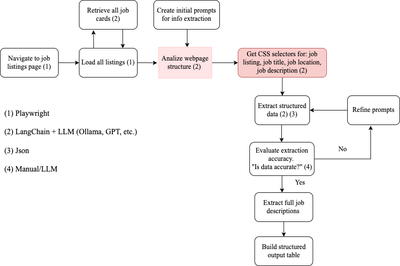

Automatically detects relevant HTML structure using a language model

Workflow Overview

1. Load the target job website.
2. Use LLM to infer the right CSS selectors.
3. Collect all job links.
4. Visit each job and extract:
   - Job title
   - Job location
   - Full job description
5. Save results in JSON.

   

